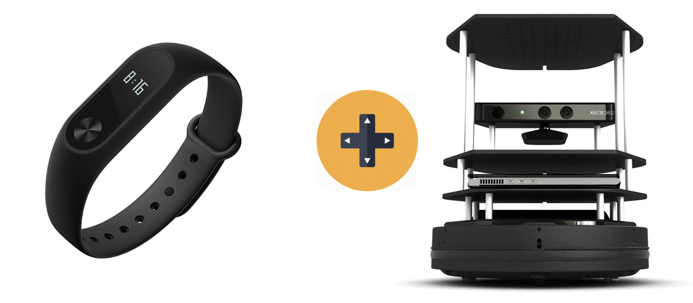

# MiBand HRX ROS Controller

A simple controller based on the 3-Axis accelerometer readings from a Xiaomi MiBand-HRX.
Python bluepy library is used to communicate with the device. The code for which can be found [here](https://github.com/4lhc/MiBand_HRX).
More information about BLE communication, parsing and processing raw accelerometer data can be found on that repo. I have also included a [Jupyter Notebook](https://github.com/4lhc/MiBand_HRX/blob/master/Notebook.ipynb) over there.

<p align="center">

</p>

## Objectives
1) Learn to use BLE
2) Including python scripts and modules to ROS packages

## TODO
- [ ] Automate build - Find a way for catkin_make to build the bluepy and pycrypto dependencies
- [ ] Try installing pycryptop using rosdep too
- [ ] BLE - Fix crash when sending alerts

## Setup
You can clone this repo - but I will list the setup process here for posterity ;)
### Setup package
```sh
catkin_create_pkg x1_miband_control rospy
cd x1_miband_control/src
```

### Get the dependencies
```sh
git submodule add https://github.com/4lhc/MiBand_HRX
git submodule add https://github.com/dlitz/pycrypto
git submodule add https://github.com/IanHarvey/bluepy

# checkout specific releases

```

